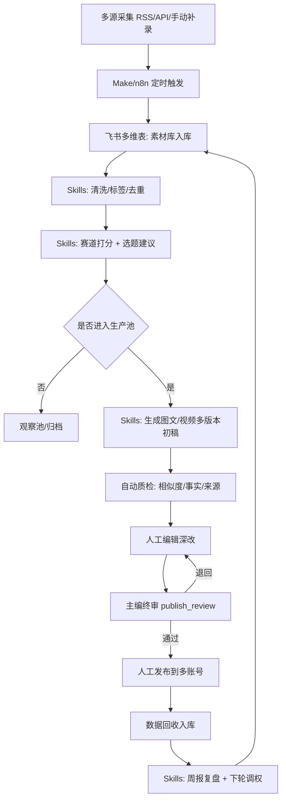

# AI时代小团队数据可视化创作体系 3.0（5人团队・多账号运营版）

> 基于 `海外数据可视化内容生产_2.0_人机协同重塑_2026-02-11.md` 升级。
> 目标场景：6个月后，5人团队，多账号分赛道运营，半自动化生产，最终发布审核权保留在负责人手上。

---

## 1. 目标与适用边界

## 1.1 核心目标
- 把“单账号内容生产”升级为“多账号、分赛道、可复用的内容工厂”。
- 在不牺牲质量和合规的前提下，将团队人效提升到可持续周更节奏。
- 建立团队级知识资产（素材、灵感、案例、工具、提示词），降低对个人经验依赖。

## 1.2 适用边界
- 适用：数据可视化图文/短视频/长文内容团队（3-8人）。
- 不适用：纯资讯搬运、完全自动发布、无人工审校的账号体系。

---

## 2. 组织设计（5人最小作战单元）

| 角色 | 人数 | 主要职责 | AI替代比例目标 |
|---|---:|---|---:|
| 主编/策略负责人 | 1 | 赛道策略、选题拍板、发布终审、节奏控制 | 20% |
| 研究与素材编辑 | 1 | 海外源采集、事实校验、数据补全 | 40% |
| 内容编导（图文+视频） | 1 | 脚本结构、叙事重构、多平台改编 | 50% |
| 设计与可视化制作 | 1 | 图表设计、封面、视觉规范、模板化 | 35% |
| 运营与增长 | 1 | 多账号排期、投放测试、私域承接、复盘 | 45% |

协作原则：
- AI负责规模化和初稿，团队负责判断、表达、风险与发布。
- 主编拥有最终 `publish_review` 一票决策权。

---

## 3. 多账号分赛道运营模型

## 3.1 账号分层
- A类（旗舰账号）：方法论、行业洞察、品牌权威。
- B类（增长账号）：实操模板、清单、高频问题解法。
- C类（实验账号）：新题材、新视觉、新叙事快速测试。

## 3.2 赛道矩阵（领域 × 人群 × 变现方向）

| 赛道ID | 领域 | 目标人群 | 内容方向 | 对应产品 |
|---|---|---|---|---|
| T1 | 商业与营销数据可视化 | 中小商家/运营 | 转化漏斗、定价、复盘看板 | 模板包/小课 |
| T2 | 职场效率与汇报 | 职场人/分析师 | 周报、复盘、汇报图表 | 模板订阅 |
| T3 | 行业研究可视化 | 咨询/研究用户 | 行研框架、数据故事化 | 深度报告/咨询 |
| T4 | 教育型可视化教程 | 新手创作者 | 图表入门、工具教程 | 训练营/陪跑 |

## 3.3 方向管理机制
- 每个赛道固定“主方向 + 备选方向 + 淘汰方向”。
- 每两周一次赛道评审，依据：完读/完播、收藏、线索、成交贡献。
- 连续3周低于阈值的方向进入降权或停更。

---

## 4. 团队知识库体系（内容生产核心资产）

## 4.1 五库一体
1. 素材库（Source Library）
2. 灵感库（Idea Library）
3. 案例库（Case Library）
4. 工具库（Tool Library）
5. 提示词库（Prompt Library）

## 4.2 字段级设计（建议先飞书多维表，后迁移Postgres）

### A. `kb_sources` 素材库
- `source_id`：素材ID
- `source_url`：链接
- `platform`：来源平台
- `topic`：主题
- `region`：地区
- `language`：语言
- `publish_time`：原发布时间
- `credibility_score`：可信度评分
- `copyright_level`：版权风险等级（low/medium/high）
- `reuse_type`：可复用方式（观点/结构/数据）
- `owner`：维护人

### B. `kb_ideas` 灵感库
- `idea_id`：灵感ID
- `from_source_id`：来源素材ID
- `track_id`：赛道
- `angle`：切入角度
- `audience`：目标人群
- `problem_statement`：要解决的问题
- `content_hypothesis`：内容假设
- `priority`：优先级
- `status`：new/tested/approved/rejected

### C. `kb_cases` 案例库
- `case_id`：案例ID
- `track_id`：赛道
- `content_type`：图文/视频/长文
- `title`：标题
- `key_structure`：结构模板
- `visual_style`：视觉风格
- `result_metrics`：结果摘要（播放、收藏、成交）
- `lessons`：复盘要点
- `replicable`：是否可复用

### D. `kb_tools` 工具库
- `tool_id`：工具ID
- `tool_name`：工具名称
- `category`：采集/分析/制图/发布/复盘
- `use_case`：适用场景
- `cost_level`：成本级别
- `stability`：稳定性评分
- `owner`：负责人
- `backup_tool`：备选工具

### E. `kb_prompts` 提示词库
- `prompt_id`：提示词ID
- `stage`：采集/清洗/改写/分发/复盘
- `track_id`：赛道
- `input_schema`：输入字段规范
- `prompt_text`：提示词正文
- `output_schema`：输出字段规范
- `quality_score`：效果评分
- `version`：版本号
- `last_validated_at`：最近验证时间

---

## 5. 生产流程（半自动）

```text
信号采集 -> 清洗去重 -> 评分分层 -> 入选题池 -> AI初稿 -> 自动质检 -> 人工深改 -> 人工终审 -> 人工发布 -> 数据回收 -> AI复盘
```

硬规则：
- 自动化可覆盖采集、标注、初稿、数据回收。
- 发布前必须经过两道人工关：`qa_review` + `publish_review`。
- 禁止自动直发到正式账号。

---

## 6. 自动化工具组合（不是全自动）

## 6.1 推荐组合
- 协作与库：飞书多维表/文档
- 流程编排：Make 或 n8n
- AI生成：Skills（内容生成、摘要、改写、质检）
- 可视化制作：Canva/Figma + 模板组件
- 数据回收：平台后台导出 + 自动入表脚本

## 6.2 流程图（Mermaid）



---

## 7. 数据结构升级（多账号运营必备）

在2.0数据库上增加3张表：

## 7.1 `accounts`（账号主数据）
- `account_id`、`platform`、`account_name`、`account_tier`（A/B/C）
- `track_id`、`owner`、`status`、`created_at`

## 7.2 `track_configs`（赛道配置）
- `track_id`、`track_name`、`audience`、`content_pillars`
- `success_metrics`、`risk_policy`、`active_flag`

## 7.3 `content_account_map`（内容-账号映射）
- `job_id`、`account_id`、`adaptation_type`（原发/改写/剪辑）
- `publish_priority`、`publish_window`、`result_score`

作用：
- 解决“一条内容多账号分发”的归因与复用问题。
- 支持“同题多版本”比较哪个账号和表达方式更有效。

---

## 8. 周期机制（周计划 + 月复盘）

## 8.1 周节奏
- 周一：赛道评审 + 选题会（定本周10条候选）
- 周二到周四：生产与发布（每天至少2条）
- 周五：数据复盘 + 下周实验项确认

## 8.2 月复盘
- 看方向：哪个赛道带来最多有效线索和成交
- 看内容：哪些结构/封面/CTA转化最高
- 看流程：哪个环节耗时最长，是否可继续自动化

---

## 9. KPI（团队版）

## 9.1 生产效率
- 周产能：>= 10条内容（含跨平台改编）
- 人均有效产出：>= 2条/周
- AI参与率：>= 75%

## 9.2 运营效果
- 多账号总曝光月增速：>= 20%
- 收藏率（图文）：>= 6%
- 完播率（视频）：>= 22%

## 9.3 商业结果
- 线索转化率：>= 2.5%
- 低价产品转化率：>= 3%
- 咨询/服务成交数：每月持续增长

## 9.4 质量与风险
- 来源标注完整率：100%
- 严重事实错误：0
- 未经终审发布：0

---

## 10. 180天路线图

1. 第1-30天：搭建五库、统一字段、跑通单赛道半自动流程。
2. 第31-60天：上线3赛道，建立A/B/C账号分层，形成周复盘机制。
3. 第61-90天：沉淀高转化模板，形成“同题多版本”标准作业。
4. 第91-180天：扩展到4赛道，建立内容资产复用系统和团队训练机制。

---

## 11. 实施底线（必须遵守）

1. AI可以生成，但不能绕过人工审核直接发布。
2. 所有内容必须可追溯到素材来源和版本记录。
3. 任何赛道扩张前，先证明已有赛道可持续产出与转化。
4. 账号增长优先级低于品牌安全和长期信任。

