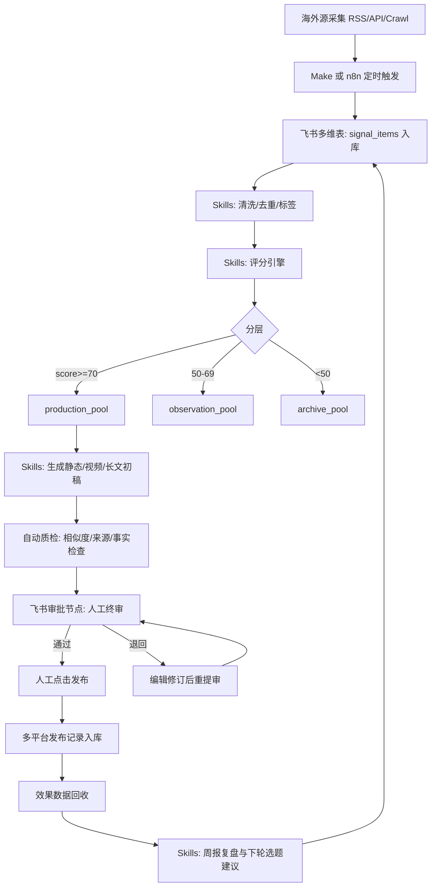

# 海外数据可视化内容生产 2.0：AI驱动全流程重塑（可落地版）

## 1. 定位与目标

**目标**：将“海外数据可视化内容搬运”升级为“AI主导的内容生产系统”，实现从信号采集到二次创作、发布、复盘、变现的闭环自动化。

**核心变化**：
- 从“人工找素材” -> “AI自动发现候选”
- 从“人工逐条改写” -> “AI批量生成多版本初稿 + 人类总编终审”
- 从“单平台发布” -> “一题多端分发”
- 从“凭感觉优化” -> “数据驱动迭代”

---

## 2. 2.0全流程架构（端到端）

```text
[海外源采集]
  -> [AI清洗/去重/标签]
  -> [价值评分引擎]
  -> [候选池(待生产)]
  -> [二次创作引擎]
      -> 静态图解版
      -> 动态短视频版
      -> 长文深度版
      -> 课程/手册版
  -> [合规质检闸门]
  -> [多平台分发]
  -> [效果回收与归因]
  -> [AI复盘与下轮选题建议]
```

---

## 3. 分层模块设计（可实施）

## 3.1 采集层（Signal Layer）
- 数据源：Google Blog/Trends、Tableau Public、Datawrapper Blog、Flourish Showcase、Observable、X、YouTube、Reddit。
- 采集方式：
  - A级：RSS/API（优先，稳定）
  - B级：网页抓取（定时任务）
  - C级：人工补录（高价值例外）
- 产出字段：`source_url, title, publish_time, topic, chart_type, tool, region, language`

**可行方案**：
- 低代码：Make/Zapier + RSS + 飞书多维表
- 代码：Python + requests + schedule + SQLite/Postgres

## 3.2 评估层（Scoring Layer）
- AI自动打分（0-100）：
  - 需求强度 25
  - 本地化空间 20
  - 二次创作成本 20
  - 分发潜力 15
  - 变现潜力 15
  - 版权风险（反向扣分）5
- 入池规则：`score >= 70` 进“本周生产池”；`50-69` 进“观察池”；`<50` 归档。

## 3.3 创作层（Remix Layer）
- 输入：候选素材 + 目标人群 + 平台 + 商业目标
- AI输出四类产物：
  1. 静态图解脚本（结构、文案、图表草图）
  2. 动态演示脚本（分镜+旁白+节奏）
  3. 长文稿（方法论 + 案例 + 实操）
  4. 产品化素材（模板包说明、课程提纲、直播提纲）
- 人工编辑只做：价值判断、观点增强、最终语言风格统一。

## 3.4 质检层（Governance Layer）
- 自动质检：
  - 相似度检测（防“伪原创”）
  - 来源标注完整性
  - 事实一致性（数字/术语）
  - 版权提示（图片/字体/图标）
- 人工终审：
  - 是否有本地新价值
  - 是否适配目标平台受众
  - 是否满足商业承接目标

## 3.5 分发与复盘层（Distribution + Feedback Layer）
- 一题多发：公众号（深度）+ 小红书（图卡）+ 视频号/抖音（短视频）+ 私域（转化）。
- 回收指标：曝光、完读/完播、收藏、私信、点击、成交。
- AI复盘：自动生成“下轮选题建议 + 最优格式建议 + 标题建议”。

---

## 4. 人机协同职责（明确边界）

| 环节 | AI职责 | 人类职责 |
|---|---|---|
| 采集与标签 | 抓取、去重、主题识别 | 确认源优先级 |
| 评分筛选 | 按规则评分 | 决定最终入选 |
| 初稿生成 | 多版本文案/脚本/图表说明 | 挑版本+深改 |
| 质检 | 相似度/事实/来源检查 | 合规终审 |
| 分发 | 生成多平台适配文案 | 发布节奏决策 |
| 复盘 | 自动报表与建议 | 选下轮策略 |

**原则**：AI负责“规模化与速度”，人负责“判断与价值”。

---

## 5. 工具栈（可行性两档）

## 5.1 MVP档（1-2人即可）
- 采集：RSS + 手动补录
- 存储：飞书多维表/Notion DB
- AI：GPT/Claude（摘要、改写、脚本）
- 设计：Canva/Figma
- 动态：CapCut/剪映
- 自动化：Make

## 5.2 进阶档（3-5人小团队）
- 采集：Python抓取 + Postgres
- 编排：n8n / Airflow
- AI链路：Prompt模板库 + RAG知识库
- 质检：文本相似度/事实校验脚本
- BI：Metabase/Looker Studio

---

## 6. 从“搬运”到“重塑”的内容生产标准

每条内容必须满足 3 重重构：
1. **数据重构**：替换或补充本地数据，不只翻译原结论。
2. **结构重构**：重写叙事顺序，面向中文用户问题。
3. **价值重构**：增加可执行步骤、模板、工具入口。

若不满足以上任意一条，不进入发布。

---

## 7. 商业化闭环（内置在流程中）

每个选题在立项时就绑定一个商业承接目标：
- 免费层：图卡/短解读（拉新）
- 低价层：模板包/方法卡（19-99）
- 订阅层：周报/案例库（49-199/月）
- 高价层：培训/咨询/看板改造（299-2999）

产线规则：
- 每周至少1条内容带“可下载模板”
- 每两周至少1次“低价包发售”
- 每月沉淀1个高客单服务案例

---

## 8. 30天落地路线（强可执行）

## 第1周：搭系统骨架
- 完成数据表结构、评分规则、来源清单。
- 建立5个Prompt模板（摘要/改写/脚本/标题/CTA）。
- 跑通“采集 -> 评分 -> 候选池”全链路。

## 第2周：跑小闭环
- 每天入池10条，生产2条，发布1条。
- 同题输出静态+动态两个版本。
- 上线首个低价模板包。

## 第3周：放大与质检
- 增加相似度与来源标注自动检查。
- 建立“多平台发布模板库”。
- 开始周复盘自动报告。

## 第4周：商业验证
- 完成一次“内容 -> 模板包 -> 订阅”转化实验。
- 复盘哪个主题和形态成交最好。
- 固化成标准SOP v2.1。

---

## 9. KPI与验收标准（可量化）

## 内容效率
- 单条内容平均生产时长 <= 90 分钟
- AI参与环节覆盖率 >= 70%
- 同题复用率 >= 3种形态

## 内容效果
- 图文收藏率 >= 5%
- 视频完播率 >= 20%
- 私信/留资率 >= 2%

## 商业效果
- 低价产品转化率 >= 3%
- 订阅转化率 >= 1.5%
- 月度复购率 >= 15%

## 合规质量
- 来源标注完整率 100%
- 高相似风险稿件发布率 0%
- 严重事实错误 0 次

---

## 10. 风险与备选方案

- 风险1：采集源不稳定
  - 备选：提高RSS/API源占比；保留人工补录池。
- 风险2：AI生成质量不稳
  - 备选：增加示例驱动Prompt；引入人工风格模板。
- 风险3：版权风险
  - 备选：只借鉴方法不复用原图；统一授权审查清单。
- 风险4：内容有流量无转化
  - 备选：每条内容绑定单一CTA和低价承接页，做A/B测试。

---

## 11. 立即执行清单（今天可做）
1. 建 `topic_pipeline` 数据表（字段按第3.1节）。
2. 建 `score_rules` 与自动打分脚本。
3. 录入20条海外候选并跑第一轮筛选。
4. 选3条高分主题，生成静态/动态双版本初稿。
5. 通过质检后发布，并接入当日复盘记录。

---

## 12. 成功判定（2.0是否成立）
满足以下条件，即可判定2.0可行：
- 连续4周稳定运行，且每周有可复现产出。
- 生产效率较1.0提升 >= 40%。
- 至少跑通一次完整商业闭环（内容->产品->成交）。
- 合规事故为0。

---

## 13. 字段级数据库设计（SQL / CSV）

## 13.1 SQL（Postgres版本，MVP可直接用）

```sql
-- 1) 信号池：采集到的原始候选
CREATE TABLE IF NOT EXISTS signal_items (
  id BIGSERIAL PRIMARY KEY,
  source_platform VARCHAR(32) NOT NULL,        -- google_blog / tableau / x / youtube / reddit ...
  source_type VARCHAR(16) NOT NULL,            -- rss / api / crawl / manual
  source_url TEXT NOT NULL,
  source_author VARCHAR(128),
  source_published_at TIMESTAMPTZ,
  title TEXT NOT NULL,
  summary TEXT,
  language VARCHAR(16) NOT NULL DEFAULT 'en',
  region VARCHAR(32) NOT NULL DEFAULT 'global',
  topic VARCHAR(128),
  chart_type VARCHAR(64),
  tool VARCHAR(64),
  tags TEXT,                                   -- 逗号分隔，MVP先用文本
  raw_payload JSONB,                           -- 原始抓取内容
  dedupe_key VARCHAR(128) UNIQUE,              -- URL+标题hash
  status VARCHAR(24) NOT NULL DEFAULT 'new',   -- new / cleaned / archived
  created_at TIMESTAMPTZ NOT NULL DEFAULT NOW(),
  updated_at TIMESTAMPTZ NOT NULL DEFAULT NOW()
);

-- 2) 评分池：AI自动评分 + 人工复核
CREATE TABLE IF NOT EXISTS topic_scores (
  id BIGSERIAL PRIMARY KEY,
  signal_id BIGINT NOT NULL REFERENCES signal_items(id) ON DELETE CASCADE,
  demand_score INT NOT NULL CHECK (demand_score BETWEEN 0 AND 25),
  localization_score INT NOT NULL CHECK (localization_score BETWEEN 0 AND 20),
  cost_score INT NOT NULL CHECK (cost_score BETWEEN 0 AND 20),
  distribution_score INT NOT NULL CHECK (distribution_score BETWEEN 0 AND 15),
  monetization_score INT NOT NULL CHECK (monetization_score BETWEEN 0 AND 15),
  copyright_risk INT NOT NULL CHECK (copyright_risk BETWEEN 0 AND 5),
  final_score INT NOT NULL,
  pool_tier VARCHAR(24) NOT NULL,              -- production_pool / observation_pool / archive_pool
  scored_by VARCHAR(24) NOT NULL DEFAULT 'ai', -- ai / human
  review_note TEXT,
  created_at TIMESTAMPTZ NOT NULL DEFAULT NOW()
);

-- 3) 生产池：进入创作后的任务单
CREATE TABLE IF NOT EXISTS content_jobs (
  id BIGSERIAL PRIMARY KEY,
  signal_id BIGINT NOT NULL REFERENCES signal_items(id) ON DELETE CASCADE,
  primary_topic VARCHAR(128) NOT NULL,
  target_audience VARCHAR(128) NOT NULL,
  biz_goal VARCHAR(64) NOT NULL,               -- 拉新 / 转化 / 复购
  content_format VARCHAR(32) NOT NULL,         -- static / video / longform / bundle
  draft_version INT NOT NULL DEFAULT 1,
  ai_draft_url TEXT,
  human_editor VARCHAR(64),
  qa_status VARCHAR(24) NOT NULL DEFAULT 'pending',     -- pending / passed / rejected
  publish_status VARCHAR(24) NOT NULL DEFAULT 'pending',-- pending / approved / scheduled / published
  scheduled_at TIMESTAMPTZ,
  published_at TIMESTAMPTZ,
  owner VARCHAR(64),
  created_at TIMESTAMPTZ NOT NULL DEFAULT NOW(),
  updated_at TIMESTAMPTZ NOT NULL DEFAULT NOW()
);

-- 4) 分发记录：一题多发
CREATE TABLE IF NOT EXISTS distribution_records (
  id BIGSERIAL PRIMARY KEY,
  job_id BIGINT NOT NULL REFERENCES content_jobs(id) ON DELETE CASCADE,
  channel VARCHAR(32) NOT NULL,                -- wechat / xhs / douyin / video_account / private
  post_title TEXT,
  post_url TEXT,
  cta_type VARCHAR(32),                        -- download / dm / pay / subscribe
  status VARCHAR(24) NOT NULL DEFAULT 'queued',
  operator VARCHAR(64),                        -- 发布执行人
  created_at TIMESTAMPTZ NOT NULL DEFAULT NOW(),
  published_at TIMESTAMPTZ
);

-- 5) 效果回收：用于AI复盘
CREATE TABLE IF NOT EXISTS performance_metrics (
  id BIGSERIAL PRIMARY KEY,
  distribution_id BIGINT NOT NULL REFERENCES distribution_records(id) ON DELETE CASCADE,
  snapshot_date DATE NOT NULL,
  impressions INT DEFAULT 0,
  clicks INT DEFAULT 0,
  reads_or_plays INT DEFAULT 0,
  completion_rate NUMERIC(5,2) DEFAULT 0,      -- 完读/完播率
  saves INT DEFAULT 0,
  leads INT DEFAULT 0,                          -- 私信/留资
  orders INT DEFAULT 0,
  revenue NUMERIC(12,2) DEFAULT 0,
  created_at TIMESTAMPTZ NOT NULL DEFAULT NOW(),
  UNIQUE(distribution_id, snapshot_date)
);

-- 6) 审核日志：确保“发布权在人”
CREATE TABLE IF NOT EXISTS approval_logs (
  id BIGSERIAL PRIMARY KEY,
  job_id BIGINT NOT NULL REFERENCES content_jobs(id) ON DELETE CASCADE,
  stage VARCHAR(32) NOT NULL,                  -- scoring_review / qa_review / publish_review
  decision VARCHAR(24) NOT NULL,               -- approve / reject / revise
  approver VARCHAR(64) NOT NULL,
  comment TEXT,
  created_at TIMESTAMPTZ NOT NULL DEFAULT NOW()
);
```

## 13.2 CSV字段设计（无数据库时可直接跑）

`topic_pipeline.csv`（候选+评分+动作）：

```csv
topic_id,source_platform,source_type,source_url,title,source_published_at,language,region,topic,chart_type,tool,tags,demand_score,localization_score,cost_score,distribution_score,monetization_score,copyright_risk,final_score,pool_tier,scored_by,review_note,status,owner,next_action
T0001,tableau,rss,https://example.com/a,How SMBs price templates,2026-02-10T09:00:00Z,en,global,模板定价与成交优化助手,bar,Tableau,"pricing,template,smb",20,15,16,12,14,1,76,production_pool,ai,优先生产,queued,Alice,生成静态+动态双版本
```

`content_jobs.csv`（生产与发布控制）：

```csv
job_id,topic_id,primary_topic,target_audience,biz_goal,content_format,draft_version,ai_draft_url,qa_status,publish_status,scheduled_at,published_at,human_editor,final_approver,publish_channel,post_url
J0001,T0001,模板定价与成交优化助手,自由职业者,转化,static,1,https://docs.example.com/draft/1,passed,approved,2026-02-12T12:00:00Z,,Bob,Alice,wechat,
```

---

## 14. 自动化流程图（半自动，发布权保留人工）

## 14.1 推荐工具组合（按成本分层）
- 轻量MVP：飞书多维表 + Make + Skills（内容生成）+ 人工发布
- 成长版：飞书多维表 + n8n + Skills + 脚本质检 + 人工发布
- 混合版：Make负责采集，n8n负责编排，飞书负责任务与审批，Skills负责生成

## 14.2 Mermaid流程图（可直接贴到支持Mermaid的平台）



## 14.3 人工保留控制点（必须人工决策）
1. `scoring_review`：高分候选是否真正进生产池。
2. `qa_review`：合规和事实是否达标。
3. `publish_review`：是否发布、何时发布、发布到哪些平台。

## 14.4 不追求全自动的落地原则
- 自动化优先做“重复、机械、可规则化”的环节（采集、打分、模板化生成、数据回收）。
- 人工优先把控“价值、风险、品牌口径、发布时机”。
- 发布动作默认人工触发，不做自动直发，避免误发和合规风险。
